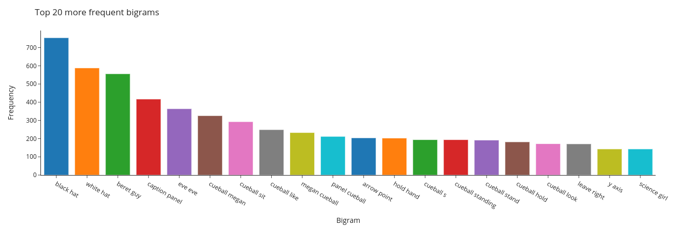
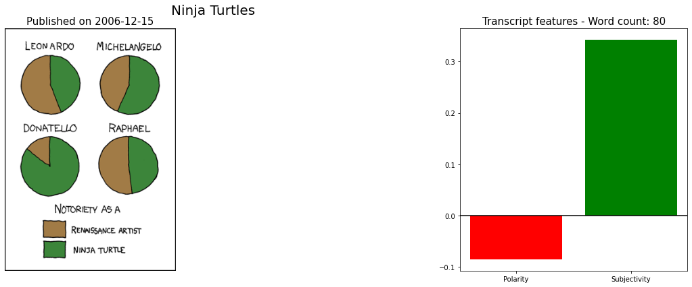

# Project XKCD

  

This project explores data from [xkcd](https://xkcd.com/) strips to do some analysis. The strips transcripts were scraped from [https://www.explainxkcd.com](https://www.explainxkcd.com).

## Important Files

* [Gettingdata](Gettingdata.ipynb): Notebook to get data directly from [xkcd](https://xkcd.com/). Good for the image URLs but the transcripts are not update by the atuhor anymore.
* [scraper](scraper.py): Actual scraper to get transcripts (and other info) for scripts from [ExplainXKCD](https://www.explainxkcd.com/).
* [Testing Scraper](scraper.ipynb): Notebook just to test features of [scraper](scraper.py).
* [EDA](EDA.ipynb): Exploring data gotten directly from XKCD.
* [EDA from XKCD](EDA-ExplainXKCD.ipynb): Exploring the data from [ExplainXKCD](https://www.explainxkcd.com/).
* [xkcd.db](xkcd.db): Scraped data saved into a SQLite database.

## Sample Graphs

 Most frequent bigrams from XKCD transcripts. 

 Example features in a specific strip. 
